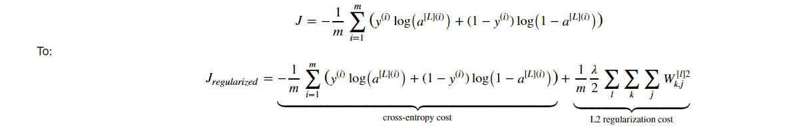

# Comparison-of-Non-Regularization-L2-Regularization-and-Dropout
A comparison of three models with same training sets and their visualization by plotting Decision-Boundary  

## Visulization of Original Dataset-
We have 211 training sets with 2 features(say x1 and x2) and labeled 0 and 1.
The plot of data by making x1 and x2 as axis we get something like this--
(when we run the file "Visulisation of Original Dataset.py")

## 1 - Non-Regularization-

In this model, I have created a deep Neural Network Model having 4 layers
 
#### ***`2 neurons`(input layer)----->>>>> `20 neurons`----->>>>>  `3 neurons` ----->>>>>>  `1 neuron`(output layer)***

#### ``Three-layer neural network: LINEAR->RELU->LINEAR->RELU->LINEAR->SIGMOID.``

After traing the dataset with a deep neural network we got to train the data with 94.78% accuracy and test set accuracy is 91%

And we are able to create a perfect Decision-Boundary to saperate the traning data.

#### The non-regularized model is obviously overfitting the training set. It is fitting the noisy points! 

## 2 - L2 Regularization- 

The standard way to avoid overfitting is called L2 regularization. It consists of appropriately modifying cost function, from:

After L2 Regularization, we got to train the data with 93.83% accuracy and test set accuracy increased to 93%.

We are not overfitting the training data anymore.

**What is L2-regularization actually doing?**:

L2-regularization relies on the assumption that a model with small weights is simpler than a model with large weights. Thus, by penalizing the square values of the weights in the cost function we drive all the weights to smaller values. It becomes too costly for the cost to have large weights! This leads to a smoother model in which the output changes more slowly as the input changes. 

## 3 - Dropout- 

**dropout** is a widely used regularization technique that is specific to deep learning. 
**It randomly shuts down some neurons in each iteration.**

The idea behind drop-out is that at each iteration, train a different model that uses only a subset of neurons. With dropout, neurons thus become less sensitive to the activation of one other specific neuron, because that other neuron might be shut down at any time.

After Dropout, we got to train the data with 92.89% accuracy and test set accuracy increased to 95%.

The test accuracy has increased again (to 95%)! The model is not overfitting the training set and does a great job on the test set. 

>  *'Used dataset and some code of Course of deeplearning.ai by Andrew Ng'*
